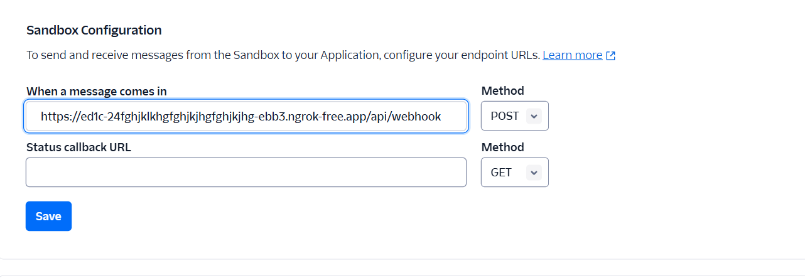
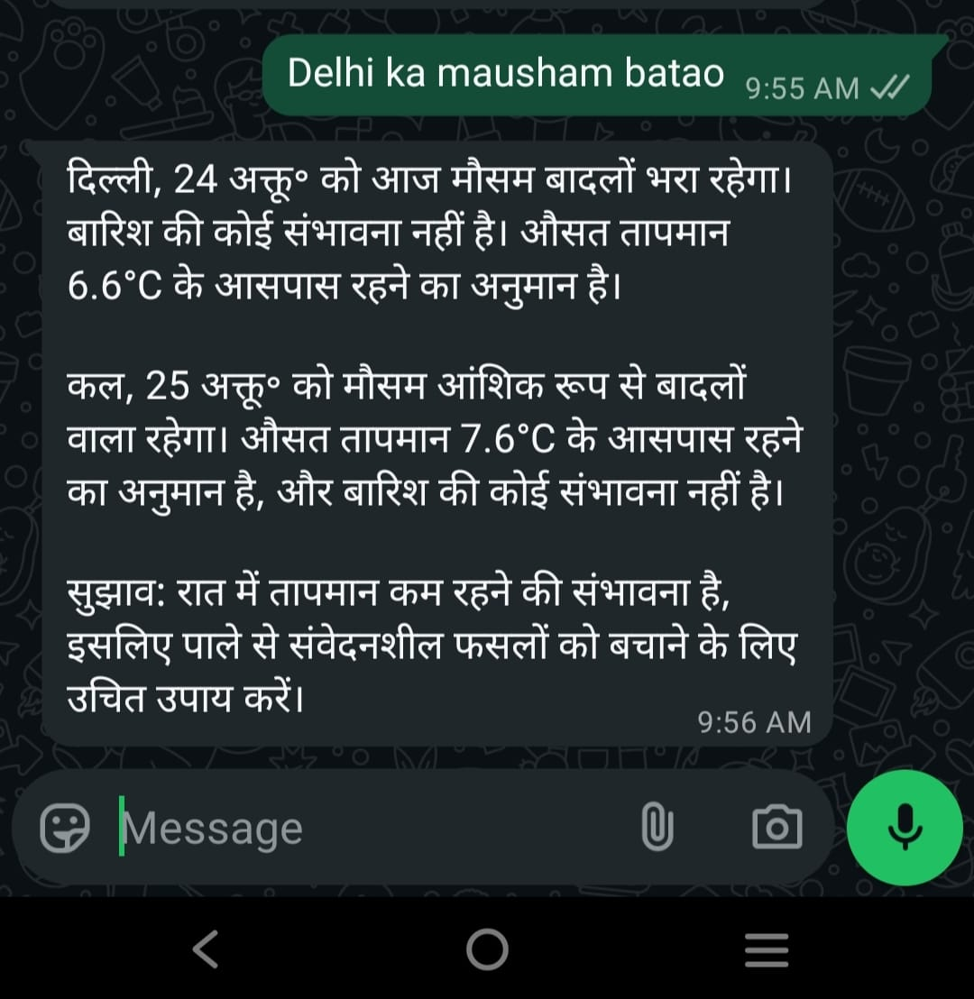
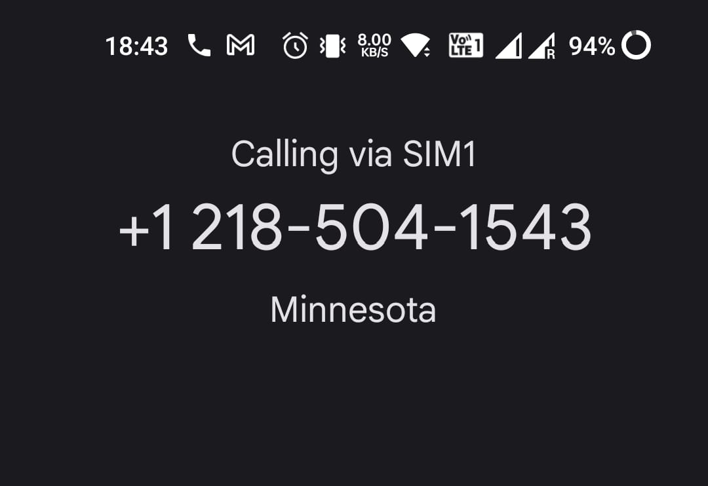

# 🌾☁️ LLM-Driven AgriWeather Alert System

## 🌟 Project Overview

The AgriWeather Alert System is an AI-powered solution designed to bridge the communication gap between critical weather information and digitally underserved farmers in rural areas. By leveraging conversational AI (LLM) and ubiquitous communication channels(SMS, WhatsApp, and Voice Calls), the system delivers accurate, personalized, and multilingual weather summaries and farming tips, requiring zero technical skill from the end-user.

### 🎯 The Problem

Over 50% of marginal farmers face crop loss due to unpredictable weather events, often relying on outdated or unreliable second-hand advice. This critical vulnerability stems from a fundamental communication gap where advanced weather data fails to reach farmers who lack smartphones, internet access, or confidence in typing queries.

### ✅ The Solution

The system automates the delivery of actionable weather intelligence:

  * **Voice-First Access:** Farmers can dial a number from any basic phone and use speech to request updates.
  * **Multilingual Summaries:** An LLM processes raw weather data into clear, crop-relevant summaries in local languages (Hindi/English).
  * **Scheduled Alerts:** Daily alerts are sent via SMS/WhatsApp once a farmer sets their primary location.
  * **Zero-Skill Interaction:** No need for apps, typing, or navigating complex menus.

-----

## 🚀 System Architecture & Technology Stack

| Category | Technology | Purpose |
| :--- | :--- | :--- |
| **Backend** | Spring Boot, Java 17, Maven | Robust, scalable RESTful API foundation. |
| **AI/NLP** | Google Cloud AI (Gemini) | Summarization of raw weather data into simple, actionable farming advice. |
| **Communication** | Twilio (SMS, WhatsApp, Voice) | Handles real-time communication delivery and TwiML for voice interaction. |
| **Scheduling** | Spring `@Scheduled` / Cron | Automates daily alert delivery (e.g., 5:00 AM and 5:00 PM). |
| **Database** | MySQL, Spring Data JPA | Stores user profiles, language preferences, and primary location data. |

-----

## 🌾 Key User Benefits & Features

### Communication Channels

  * **📞 Voice Call (Zero Internet Required):** Farmers can call a number, speak their city name, and instantly receive weather updates in their chosen language.
  * **📩 SMS & WhatsApp:** Used for scheduled daily alerts once a primary location is set.
  * **Natural Interaction:** Farmers speak their city name; no IVR menus or typing necessary.

### Intelligence & Accessibility

  * **Bilingual Support:** Full support for Hindi and English, selectable via voice call.
  * **Automated Updates:** Once a location is registered, daily alerts are sent automatically, saving time and effort.
  * **Reliable Data:** Summaries are based on real-time data from a reliable Weather API.

-----

## ▶️ Local Setup and Execution

### Prerequisites

1.  **Software:** Java JDK 17+, Maven 3.6+.
2.  **Accounts:** [Twilio](https://www.twilio.com/), [Google Cloud AI Gemini](https://aistudio.google.com/), Weather API (e.g., OpenWeatherMap).

### 1\. Clone and Configure

```bash
git clone https://github.com/your-username/agriweather-alert.git
cd agriweather-alert
```

Configure your credentials in `src/main/resources/application.properties`:

```properties
# Twilio Credentials
twilio.account.sid=...
twilio.auth.token=...
twilio.whatsapp.number=...

# Gemini AI Key
gemini.api.key=...

# Weather API Key (e.g., OpenWeatherMap)
weather.api.key=...

# MySQL Configuration
spring.datasource.url=...
spring.datasource.username=...
spring.datasource.password=...
```

### 2\. Build and Run

```bash
mvn clean install
mvn spring-boot:run
# Application runs on http://localhost:8080 by default
```

-----

## 🌐 External Service Integration (Twilio Webhooks)

Since Twilio needs to call your local machine, you must expose your local server using a tool like **Ngrok**.

### 1\. Expose Localhost (Using Ngrok)

```bash
ngrok http 8080
```

Copy the generated HTTPS URL (e.g., `https://abcd1234.ngrok.io`).

### 2\. Configure Twilio Webhooks

| Service | Twilio Console Path | Webhook URL (POST Method) | Notes |
| :--- | :--- | :--- | :--- |
| **WhatsApp/SMS** | Messaging \> WhatsApp Sandbox | `https://your-ngrok-url.ngrok.io/api/webhook` | Used for all message-based interactions. |


| **Voice Call** | Phone Numbers \> Active Numbers \> Voice & Fax | `https://your-ngrok-url.ngrok.io/api/voice` | Used for interactive TwiML flow. |

-----

## 📱 User View (WhatsApp)

### 1. Update Location (via WhatsApp or Call)


### 2. Language Friendly

* #### In english


* ##### In Hindi



### 3. Automatically Scheduled Alerts

Alerts sent at set time daily.

---

## 📞 User View (Voice Call)

### 1. Call the Given Number



### 2. Select the language choice

* Listen to the call instructions (e.g., press 1 for Hindi, 2 for English).
* After selecting the language, all further communication will be in that language.

### 3. Get Weather Updates

* Speak the city name for which you want weather updates.
* Listen to the weather updates.

### 4. Set Primary Location

* press the instructed key to if you want to set this city as your primary location.
* Once set, you will receive daily weather updates via SMS/WhatsApp for that location.


-----

## 📧 Contact & License

For questions, contributions, or concerns, please open an issue or connect on [LinkedIn](https://www.linkedin.com/in/tulika-basu-580547251/).

This project is licensed under the [MIT License](https://www.google.com/search?q=LICENSE).
